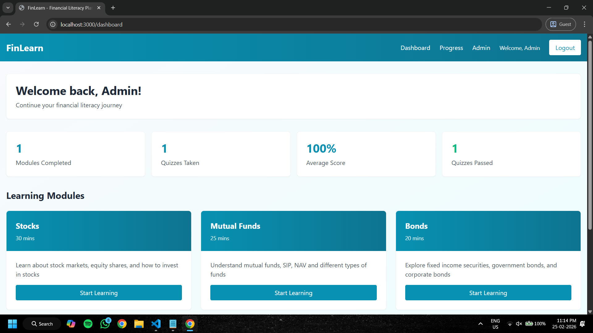
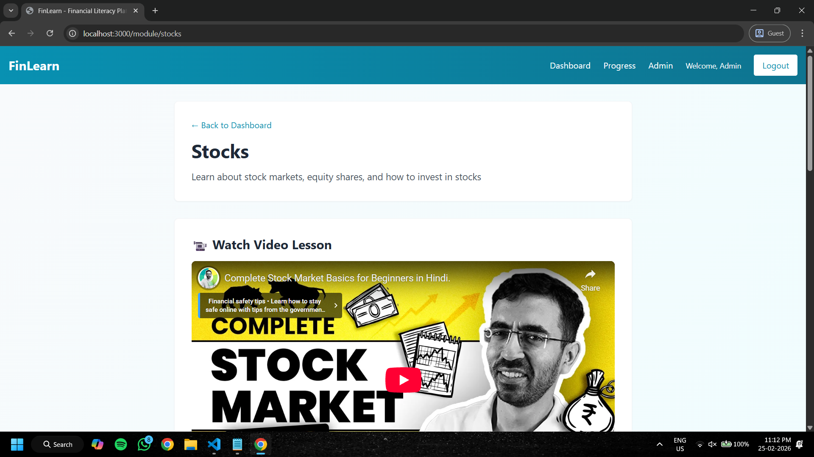
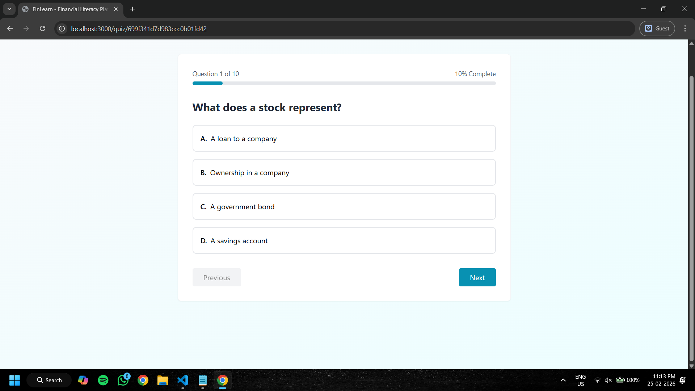
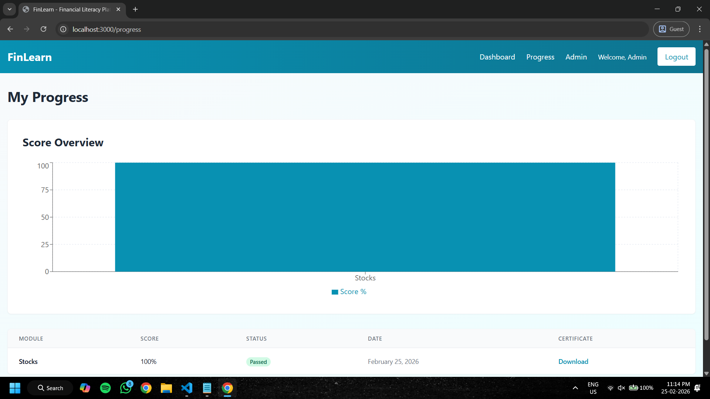
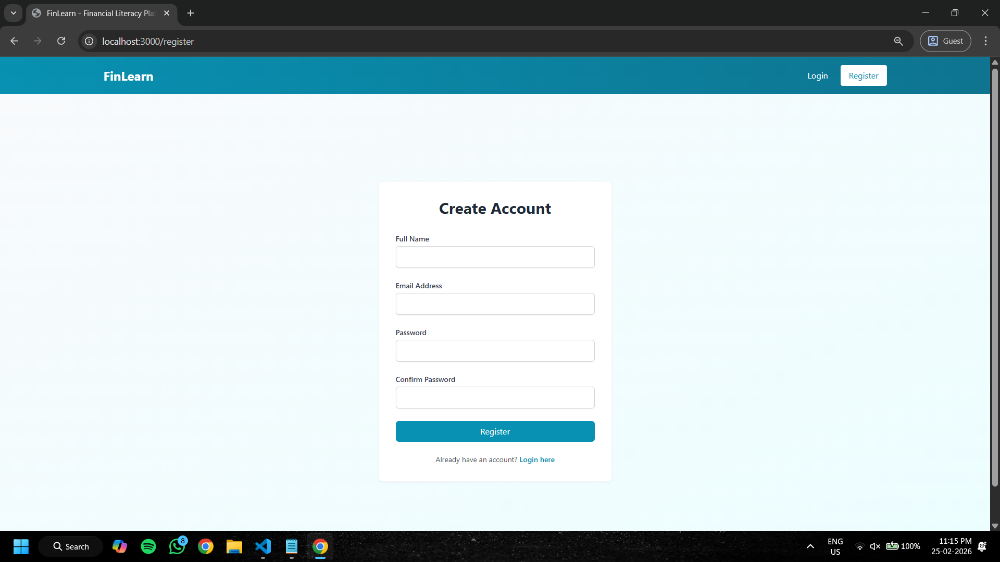
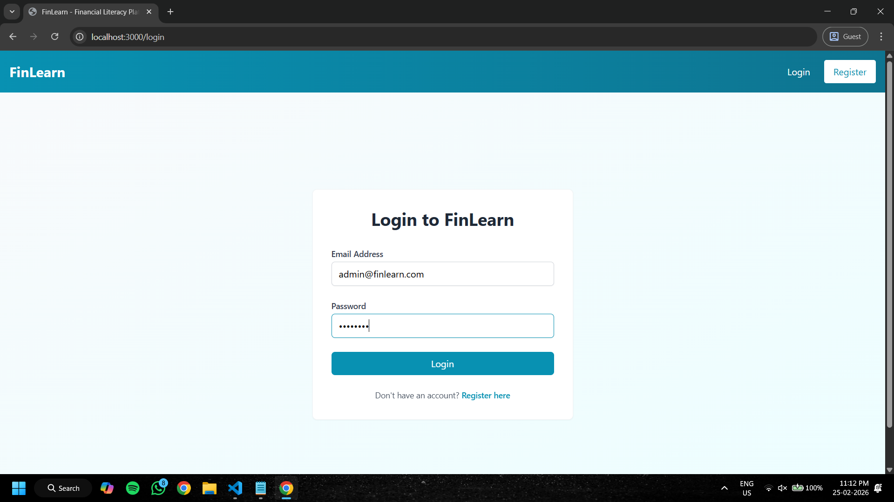

# 🚀 FinLearn

> A modern MERN-based financial learning platform focused on interactive education, quiz-driven progress tracking, and scalable full-stack architecture.


---

# 📌 Overview

FinLearn is a full-stack educational platform designed to help users learn financial concepts through structured modules, embedded video lessons, and interactive quizzes.

The project evolved from a traditional MERN application into a more production-oriented architecture featuring:

* Layered backend structure
* Centralized error handling
* Redux-powered state management
* JWT authentication
* Persistent analytics tracking
* Normalized API response handling
* Protected learning workflows

This project focuses heavily on:

* Real-world frontend/backend integration
* API contract consistency
* State synchronization
* Scalable architecture patterns
* Production-style debugging and stabilization

---

# ✨ Features

## 🔐 Authentication System

* JWT-based authentication
* Protected routes
* Persistent login sessions
* Secure middleware validation

## 📚 Learning Modules

* Structured finance learning modules
* Embedded YouTube video lessons
* Dynamic module routing
* Progress-aware navigation

## 🧠 Quiz Engine

* Interactive quizzes
* Real-time scoring
* Submission tracking
* Persistent quiz history

## 📊 Analytics Dashboard

* Average score tracking
* Quiz completion analytics
* Learning progress statistics
* Performance insights

## 🏗️ Backend Architecture

* Controller-Service architecture
* Validation middleware
* Centralized error handling
* Standardized API responses

---

# 🧱 Tech Stack

## Frontend

* React
* Redux Toolkit
* React Router DOM
* Axios
* Tailwind CSS
* Vite

## Backend

* Node.js
* Express.js
* MongoDB
* Mongoose
* JWT Authentication
* Express Validator

---

# 📂 Project Structure

```bash
FinLearn/
│
├── backend/
│   ├── controllers/
│   ├── middleware/
│   ├── models/
│   ├── routes/
│   ├── services/
│   ├── utils/
│   ├── validations/
│   └── server.js
│
├── frontend/
│   ├── src/
│   │   ├── components/
│   │   ├── pages/
│   │   ├── services/
│   │   ├── store/
│   │   └── utils/
│
└── README.md
```

---

# ⚙️ Installation & Setup

## 1️⃣ Clone Repository

```bash
git clone https://github.com/Anuj18m/FinLearn.git
cd FinLearn
```

---

## 2️⃣ Backend Setup

```bash
cd backend
npm install
```

### Create `.env`

```env
PORT=YOUR_PORT_NUMBER
MONGODB_URI=YOUR_MONGODB_URI_HERE
JWT_SECRET=YOUR_SECRET_KEY
NODE_ENV=development
```

### Start Backend

```bash
npm run dev
```

---

## 3️⃣ Frontend Setup

```bash
cd frontend
npm install
npm run dev
```

---

# 🧪 Core Workflows Tested

The following flows were fully tested during stabilization:

✅ User Registration
✅ Login Authentication
✅ Protected Route Access
✅ Module Navigation
✅ Video Lesson Rendering
✅ Quiz Submission Flow
✅ Analytics Updates
✅ MongoDB Persistence
✅ Redux Synchronization
✅ Dashboard Refresh Stability

---

# 🧠 Engineering Highlights

## 🔄 Standardized API Responses

All backend endpoints follow a unified response envelope:

```json
{
  "success": true,
  "data": {}
}
```

This improved:

* frontend consistency
* Redux normalization
* debugging clarity
* scalability

---

## 🛡️ Defensive UI Architecture

Implemented defensive rendering and guarded API requests to prevent:

* undefined state crashes
* malformed API calls
* hydration timing issues
* asynchronous rendering failures

---

## 📈 Persistent Analytics Engine

FinLearn tracks:

* highest quiz scores
* quizzes attempted
* module completion
* overall progress

using MongoDB-backed persistence.

---

# 🚀 Future Roadmap (FinLearn V2)

Planned upgrades include:

* AI-powered learning recommendations
* Admin dashboard
* Smart quiz explanations
* Advanced analytics charts
* Dark mode & design system
* CI/CD pipelines
* Automated testing
* SaaS-grade UI overhaul

---

# 📸 Screenshots

## 🏠 Dashboard


---

## 📚 Module Learning Page


---

## 🧠 Quiz Interface


---

## 📊 Analytics Overview


---

## 🔐 Authentication Pages




---

# 🤝 Contributing

Contributions, suggestions, and improvements are welcome.

```bash
Fork → Improve → Pull Request 🚀
```

---

# 👨‍💻 Author

### Anuj Mhatre

* Full Stack Developer
* MERN Stack Enthusiast
* Passionate about scalable application architecture and product engineering.

GitHub: [https://github.com/Anuj18m](https://github.com/Anuj18m)

---

⭐ If you found this project interesting, consider giving it a star!
